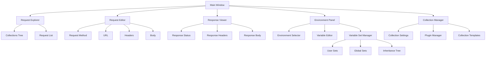

# Neovim UI Specification

## Overview
The Neovim UI provides a terminal-based interface for interacting with shc (Simple HTTP Client) directly within Neovim. This interface allows users to manage, create, and execute HTTP requests while leveraging Neovim's powerful editing capabilities and keybindings.

## Features

### Core Features
- Request Management
  - View and navigate through existing requests
  - Create new requests
  - Edit existing requests
  - Delete requests
  - Organize requests in collections/folders
- Collection Management
  - Collection-level settings and configurations
  - Plugin management per collection
  - Collection-specific variable sets
  - Collection templates and presets
  - Collection sharing and synchronization
- Request Execution
  - Execute requests directly from Neovim
  - View response details including headers, body, and status
  - Support for different response formats (JSON, XML, Plain Text)
- Environment Management
  - Switch between environments
  - Edit environment variables
  - Create new environments
  - View active environment
- Variable Set Management
  - Create and manage variable sets (e.g., different users, API keys)
  - Quick switching between variable sets
  - Inheritance and override capabilities
  - Import/export variable sets
  - Share variable sets between environments

## User Interface Layout



## Components

### Request Explorer
- Tree-style view of collections and requests
- Collapsible folders/collections
- Visual indicators for request methods (GET, POST, etc.)
- Quick search functionality

### Request Editor
- Split into sections:
  - Method selector
  - URL input with environment variable expansion
  - Headers editor (key-value format)
  - Request body editor with syntax highlighting
- Support for different body formats (JSON, Form Data, Raw)

### Response Viewer
- Status line showing response code and time
- Collapsible headers section
- Formatted response body with syntax highlighting
- Response size and timing information
- Support for response body search
- Advanced JSON handling:
  - Automatic JSON folding
  - JSON path navigation
  - jq-style query support
  - JSON schema validation
  - JSON diff view
- Response Analysis:
  - Response time metrics
  - Size analysis
  - Header analysis
  - Security headers check
- Response Manipulation:
  - Filter responses using jq queries
  - Transform response format (JSON, YAML, XML)
  - Extract values to environment variables
  - Save response to file
- Response Visualization:
  - Toggle between raw and formatted view
  - Syntax-aware folding
  - Mini-map for large responses
  - Search result highlighting
- Response History:
  - Compare with previous responses
  - Response timeline
  - Response statistics

### Environment Panel
- Dropdown for environment selection
- Variable editor in key-value format
- Quick variable search
- Variable value preview
- Variable set management interface
  - Tree view of available variable sets
  - Visual inheritance indicators
  - Quick set switching
  - Set comparison view

### Variable Set Management
- Hierarchical organization of variable sets
  - Global sets (shared across environments)
  - Environment-specific sets
  - User-specific sets
- Set operations:
  - Create/Edit/Delete sets
  - Clone existing sets
  - Import/Export sets
  - Share sets between environments
- Inheritance system:
  - Multiple inheritance support
  - Override visualization
  - Conflict resolution
- Version control integration:
  - Set history tracking
  - Revert capabilities
  - Diff view between sets

### Collection Manager
- Collection-level configuration
  - Settings specific to each collection
  - Plugin management interface
  - Collection templates
  - Access control settings
- Plugin management
  - Install/remove plugins per collection
  - Plugin configuration interface
  - Plugin dependency management
  - Plugin version control
- Collection templates
  - Predefined collection structures
  - Custom template creation
  - Template sharing
- Collection synchronization
  - Git integration
  - Remote backup
  - Team sharing capabilities
- Collection-specific features
  - Custom scripts
  - Pre/post request hooks
  - Collection-level variables
  - Request middleware

## Keybindings

### Global
- `<leader>sr` - Open request explorer
- `<leader>se` - Open environment panel
- `<leader>sh` - Show help menu
- `<C-x>` - Execute current request
- `?` - Toggle help menu (available in any context)
- `<leader>?` - Search keybindings

### Request Explorer
- `<CR>` - Open request
- `n` - New request
- `d` - Delete request
- `r` - Rename request
- `c` - Create collection
- `f` - Quick find

### Request Editor
- `<C-s>` - Save request
- `<Tab>` - Navigate between sections
- `<C-e>` - Quick edit environment variable

### Response Viewer
- `q` - Close response
- `/` - Search in response
- `<C-f>` - Toggle response formatting
- `<C-c>` - Copy response

### Environment Panel
- `<CR>` - Edit variable
- `n` - New variable
- `d` - Delete variable
- `<C-s>` - Save changes

### Variable Set Management
- `<leader>sv` - Open variable set manager
- `<C-n>` - Create new variable set
- `<C-i>` - Import variable set
- `<C-e>` - Export variable set
- `<Tab>` - Quick switch between sets
- `<C-c>` - Clone current set
- `<C-d>` - Show diff view
- `<C-h>` - Show inheritance tree

### Collection Management
- `<leader>sc` - Open collection manager
- `<leader>sp` - Open plugin manager
- `<C-t>` - Create collection from template
- `<C-p>` - Install/manage plugins
- `<C-s>` - Collection settings
- `<C-h>` - Collection history
- `<C-b>` - Collection backup
- `<C-r>` - Collection restore

### Help Menu
- `?` - Toggle help menu
- `<CR>` - Select help topic
- `/` - Search help topics
- `q` - Close help menu
- `<Tab>` - Next help section
- `<S-Tab>` - Previous help section
- `<C-f>` - Forward one page
- `<C-b>` - Backward one page

## Configuration

```lua
{
  -- UI Configuration
  ui = {
    theme = "auto",  -- auto, light, dark
    icons = true,    -- use icons in UI
    border = "rounded",
    highlights = {
      -- Custom highlight groups
    }
  },
  
  -- Layout Configuration
  layout = {
    explorer_width = 30,
    response_height = "50%",
    environment_width = 30
  },
  
  -- Keybinding Configuration
  keymaps = {
    -- Custom keybindings
  },
  
  -- Response Handling
  response = {
    max_size = "10MB",
    timeout = 30000,
    formatters = {
      -- Custom formatters
    }
  },
  
  -- Variable Set Configuration
  variable_sets = {
    storage_path = "~/.config/shc/variable_sets",
    auto_backup = true,
    backup_count = 5,
    inheritance = {
      max_depth = 3,
      conflict_resolution = "override", -- override, merge, prompt
    },
    sync = {
      enabled = true,
      remote_url = "", -- Optional remote sync location
      sync_on_change = false
    }
  },
  
  -- Collection Configuration
  collections = {
    default_template = "basic",
    storage_path = "~/.config/shc/collections",
    sync = {
      enabled = true,
      provider = "git", -- git, remote, local
      auto_sync = false,
      sync_interval = 3600
    },
    plugins = {
      auto_install = true,
      allow_third_party = false,
      trusted_sources = [
        "https://github.com/shc-plugins/*"
      ]
    },
    templates = {
      path = "~/.config/shc/templates",
      allow_remote = true
    }
  },
  
  -- Response Viewer Configuration
  response_viewer = {
    default_format = "auto", -- auto, json, yaml, xml, raw
    max_response_size = "50MB",
    folding = {
      auto_fold = true,
      max_depth = 3,
      fold_large_arrays = true,
      array_threshold = 50
    },
    json = {
      query_history_size = 100,
      default_jq_flags = "--raw-output",
      format_on_load = true,
      schema_validation = true
    },
    diff = {
      algorithm = "patience",
      context_lines = 3
    },
    highlights = {
      json = {
        keys = "Special",
        strings = "String",
        numbers = "Number",
        booleans = "Boolean",
        null = "Comment"
      }
    }
  },
  
  -- Help Menu Configuration
  help = {
    auto_show_on_startup = false,
    width = "80%",
    height = "60%",
    position = "center", -- center, top, bottom
    show_keybindings = true,
    show_examples = true,
    sections = {
      "Getting Started",
      "Request Management",
      "Response Handling",
      "Environment Management",
      "Collection Management",
      "Variable Sets",
      "Plugins",
      "Advanced Features"
    }
  }
}
```

## Integration

### Required Neovim Version
- Neovim 0.8.0 or higher

### Dependencies
- nvim-treesitter (for syntax highlighting)
- plenary.nvim (for async operations)
- telescope.nvim (optional, for fuzzy finding)

### Plugin Installation
```lua
-- Using packer
use {
  'shc/nvim-ui',
  requires = {
    'nvim-treesitter/nvim-treesitter',
    'nvim-lua/plenary.nvim',
    'nvim-telescope/telescope.nvim' -- optional
  }
}
```

## Extension Points

### Custom Request Templates
```lua
require('shc.templates').add({
  name = "GraphQL Query",
  method = "POST",
  headers = {
    ["Content-Type"] = "application/graphql"
  },
  body = "query {\n  \n}"
})
```

### Response Formatters
```lua
require('shc.formatters').add({
  name = "custom-json",
  pattern = "application/json",
  format = function(body, opts)
    -- Custom formatting logic
    return formatted_body
  end,
  fold = function(body, level)
    -- Custom folding logic
    return fold_points
  end,
  query = function(body, query)
    -- Custom query logic (jq-like)
    return query_result
  end
})
```

### Variable Set Providers
```lua
require('shc.variable_sets').add_provider({
  name = "git-secrets",
  type = "remote",
  fetch = function()
    -- Custom logic to fetch variables from git secrets
    return variables
  end,
  sync = function(variables)
    -- Custom logic to sync variables back to git secrets
  end
})
```

### Variable Set Templates
```lua
require('shc.variable_sets').add_template({
  name = "API User",
  variables = {
    API_KEY = "",
    USER_ID = "",
    ROLE = "user",
    PERMISSIONS = ["read", "write"]
  },
  inherits = ["base", "auth"]
})
```

### Collection Plugins
```lua
require('shc.collections').register_plugin({
  name = "oauth-helper",
  version = "1.0.0",
  dependencies = {
    "jwt-decoder"
  },
  setup = function(opts)
    -- Plugin setup logic
  end,
  hooks = {
    pre_request = function(request)
      -- Pre-request modification
    end,
    post_request = function(response)
      -- Post-request handling
    end
  }
})
```

### Collection Templates
```lua
require('shc.collections').register_template({
  name = "api-collection",
  description = "Standard API Collection Template",
  structure = {
    auth = {
      login = "templates/auth/login.http",
      refresh = "templates/auth/refresh.http"
    },
    users = {},
    admin = {
      restricted = true,
      requires_plugin = "admin-tools"
    }
  },
  plugins = {
    required = ["oauth-helper"],
    optional = ["response-analyzer"]
  },
  variables = {
    sets = ["base", "auth"],
    required = ["API_URL", "CLIENT_ID"]
  }
})
```

### Collection Middleware
```lua
require('shc.collections').add_middleware({
  name = "request-logger",
  priority = 1,
  before_request = function(request)
    -- Log request details
  end,
  after_request = function(response)
    -- Log response details
  end
})
```

### Help Content Providers
```lua
require('shc.help').register_section({
  name = "Custom Features",
  priority = 50,
  content = function()
    return {
      title = "Custom Features",
      description = "Description of custom features",
      sections = {
        {
          title = "Feature One",
          content = "Feature one description",
          examples = {
            "Example 1",
            "Example 2"
          }
        }
      },
      keybindings = {
        ["<leader>cf"] = "Custom feature action"
      }
    }
  end
})
```

## Error Handling
- Clear error messages in Neovim notifications
- Error logging to debug file
- Graceful fallbacks for network issues
- Invalid request validation before execution

## Security Considerations
- Secure storage of sensitive environment variables
- No logging of sensitive data
- Optional request confirmation for destructive methods
- TLS certificate validation

## Performance Considerations
- Async request execution
- Lazy loading of UI components
- Response streaming for large payloads
- Efficient response rendering for large datasets

## Future Enhancements
- Request history
- Request chaining
- Response diffing
- GraphQL schema support
- OpenAPI/Swagger import
- Request sharing
- Response scripting
- Variable set synchronization across teams
- Variable set version control integration
- Variable set conflict resolution improvements
- Variable set search and filtering
- Variable set templates and presets
- Collection-level access control
- Advanced plugin dependency management
- Plugin marketplace integration
- Collection analytics and metrics
- Cross-collection request chaining
- Collection documentation generation
- Collection health monitoring
- Plugin performance profiling
- Advanced response analysis tools
- Custom response visualizations
- Response transformation pipelines
- Interactive JSON query builder
- Response schema inference
- Machine-readable API documentation generation
- Response pattern matching and alerting
- Context-aware help system 